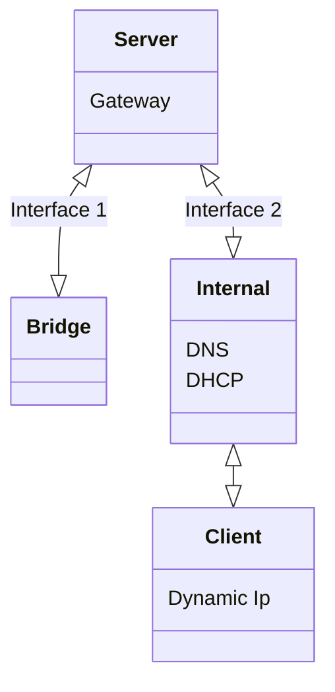

# Server NICs Setup

Before booting your machine set the default network interface to `bridge` and a second one as `internal`

# Seting Up & Using SSH

After booting the vm go to `/etc/ssh/sshd_config` and uncomment `PasswordAuthentication yes` . Save and get the vm ip with `ip a`.

Download & open "Solar-PuTTY.exe" from the repo and add a new ssh session with your **username** and **ip**.

Do all of the following in this terminal, utilize the **copy** and **paste** function.

**<u>Do Not Write Code. Copy It !</u>**

## Sudo

**Sudo** is used to elevate the privileges of the current user to essentially root.

`sudo «command»`

For this guide make sure to **login to root** with `sudo su`

## Update , Upgrade & Install

`apt update` : Update Repos

`apt upgrade` : Upgrade All Packages

`apt install «package»` : Install a Package

For this guide make sure to do `apt update` before trying to install any package.

## Users

`add «username»` : Add a User

`usermod -aG «groupname» «username»` : Add a User to Group

## Permissions

## Network Config (Netplan)

Default config file: `/etc/netplan/00-installer-config.yaml`

Note! : Make a backup of the config file with : `mv /etc/netplan/00-installer-config.yaml /etc/netplan/00-installer-config.yaml.bk`

Replace the config file with:

```yaml
network:
  ethernets:
    enp0s3:
      dhcp4: true
    enp0s8:
      dhcp4: false
      addresses: [192.168.100.254/24]
      nameservers:
        addresses: [127.0.0.1,8.8.8.8]
      dhcp6: false
  version: 2
```

`netplan apply` : Update & Apply Config

`ip a` : Show Network Details

## Services (Systemd)

`systemctl -t service` : List With Status of All System Services

`systemctl list-unit-files -t service`

`systemctl status «servicename»` : Check Status of Service

`systemctl stop «servicename»` : Stop Service

`systemctl start «servicename»` : Start Service

`systemctl restart «servicename»` : Restart Service

`systemctl reload «servicename»` : Reload Service

## IPV4 Forward

Uncomment `net.ipv4.ip_forward=1` from `/etc/sysctl.conf`

`sysctl -p` : Load settings from `/etc/sysctl.conf`

## Iptables

`iptables -t nat -A POSTROUTING -o enp0s3 -j MASQUERADE`

`apt install iptables-persistent` : Install iptables-persistent

`iptables-save > /etc/iptables/rules.v4` : Save Iptables Rules

## DHCP Server (isc-dhcp-server)

`apt install isc-dhcp-server` : Install The DHCP Server

Note! : Make Backup of Config File : `cp /etc/dhcp/dhcpd.conf /etc/dhcp/dhcpd.conf.bk`

Config file: `/etc/dhcp/dhcpd.conf`

```shell
option domain-name "prof.pdl";
option domain-name-servers 192.168.100.254, 8.8.8.8;

default-lease-time 600;
max-lease-time 7200;

ddns-update-style none;

authoritative;

subnet 192.168.100.0 netmask 255.255.255.0 {
    option routers 192.168.100.254;
    option subnet-mask 255.255.255.0;
    range dynamic-bootp 192.168.100.1 192.168.100.20;
}
```

`systemctl restart isc-dhcp-server ` 

`systemctl status isc-dhcp-server`

## DNS Server (BIND)

`apt install bind9 bind9utils` :

`/etc/bind/named.conf` : Config BIND (Internal Network)

`include "/etc/bind/named.conf.internal-zones";`

### Internal Network Config

Config file: `/etc/bind/named.conf.internal-zones`

```shell
zone "prof.pdl" IN {
    type master;
    file "/etc/bind/prof.pdl.lan";
    allow-update { none; };
};

zone "100.168.192.in-addr.arpa" IN {
    type master;
    file "/etc/bind/100.168.192.db";
    allow-update { none; };
};
```

### Bind Options

Config file: `/etc/bind/named.conf.options`

```shell
acl internal-network {
192.168.100.0/24;
127.0.0.0/8;
};

options {
    directory "/var/cache/bind";

    dnssec-validation auto;

    listen-on-v6 { any; };

    allow-query { localhost; internal-network; };

    allow-transfer { localhost; };

    recursion yes;
};
```

### DNS Zones (Zone prof.pdl)

Config File: `/etc/bind/prof.pdl.lan`

```shell
$TTL 86400
@    IN    SOA    server.prof.pdl. root.prof.pdl. (
    20210420        ;Serial
        3600        ;Refresh
        1800        ;Retry
        604800        ;Expire
        86400        ;Minimum TTL
)

    IN    NS    server.prof.pdl.
    IN    A    192.168.100.254
    IN    MX 10    server.prof.pdl.

server    IN    A    192.168.100.254
www    IN    A    192.168.100.221

ftp    IN    CNAME    server.prof.pdl.
mail    IN    CNAME    server.prof.pdl.
```

### DNS REVERSE Zone prof.pdl

Config File: `/etc/bind/100.168.192.db`

```shell
$TTL 86400
@    IN    SOA    server.prof.pdl. root.prof.pdl. (
        20210420    ;Serial
        3600        ;Refresh
        1800        ;Retry
        604800        ;Expire
        86400        ;Minimum TTL
)

    IN    NS    server.prof.pdl.

220    IN    PTR    server.prof.pdl.
221    IN    PTR    www.prof.pdl.
```

`systemctl restart named`

`netplan apply`

---

`dig server.prof.pdl`

`nslookup server.prof.pdl`
